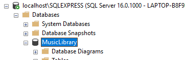

# Music Database Generator
An idea to help organize your music into a SQL Server Database using the metadata already found on your music files. Additionally, some fields are left to the user to fill in manually or for use in custom music apps.

# Setup / Installation

## Database Creation

First, connect to a local database engine using a database management program of your choice. If you're not sure where to start, keep reading, otherwise skip ahead to the next paragraph of this section. First, you will need to [download SSMS](https://learn.microsoft.com/en-us/sql/ssms/download-sql-server-management-studio-ssms?view=sql-server-ver16) or another way to execute a sql script on SQL Server. Next, [download SQL Server Express](https://www.microsoft.com/en-us/sql-server/sql-server-downloads). Be sure you get the "Express" version, as this project was not tested using the "Developer" version. If you use the "Basic" settings during installation, this project will be set up automatically to point to your newly created local database engine.

If your database engine is not named `localhost\SQLEXPRESS`, go to the file `App.config` in this project and change the line that looks like...
```xml
<add name="MusicLibraryContext" connectionString="data source=localhost\SQLEXPRESS;initial catalog=MusicLibrary;integrated security=True;MultipleActiveResultSets=True;App=EntityFramework" providerName="System.Data.SqlClient" />
```
so that the `connectionString` attribute has the name of your database as the `data source`. If your database name is something like `localhost\MY_LOCAL_DATABASE_NAME`, this line should look like:
```xml
<add name="MusicLibraryContext" connectionString="data source=localhost\MY_LOCAL_DATABASE_NAME;initial catalog=MusicLibrary;integrated security=True;MultipleActiveResultSets=True;App=EntityFramework" providerName="System.Data.SqlClient" />
```

Now that the local database is created and the project is pointing at it, we need to add empty tables by running the SQL script found at `Schema/db_initialize.sql` using SSMS or your prefered tooling. To do this in SSMS, connect to your database engine using its name (determined above; something like `localhost\SQLEXPRESS`) and using "Windows Authentication". Create a new query by pressing Ctrl+N, paste in that file, and run it using F5. If you select the database engine in the object explorer, then click the refresh button at the top of the object explorer window, you should be able to expand the engine, database, and other folders within that window to see the `MusicLibrary` database. This confirms that the database has initialized successfully.



## Prepare Your "Raw" Music Data

It is recommended that your music is in `.mp3`, `.m4a`, `.wma` or `.flac` formats when using this tool. `.wav` files are partially supported, but have far less metadata than the aformentioned file types. Most professionally published `.wav` files follow the below convention to define additional metadata for the file:
```
[Artist Name] - [Album Name] - [Track Order in Album] [Title].wav
```
If you must use `.wav` files, following the above convention will ensure that this tool adds that data to the database. A list of `.wav` files that you may want to replace can be found in `files_with_limited_data.txt` at the root of this project (which is created unpon running the project). Note that files listed in this log are not checked for duplicates (i.e. if you have `.wav` and `.mp3` files for the same song, these `.wav` files will still appear in this log).

Additionally, though the fully supported file types have the _potential_ to have much more metadata in them, certain publishers of music may or may not include (many) fields. If you see a lot of `NULL` values associated with a specific track, look at the file's properties directly and add any missing data to the file itself, rather than directly inserting into the database. Additional information on how data was parsed for particular files can be found in `generation.txt` in the root of this project (which is created unpon running the project).

## Data Generation

Use the config variables found in `appsettings.json` to configure how you want this tool to run. The following are available options:
- `MusicFolderPathAbsolute`: put the absolute path to your music directory that you want this tool to read. Note that this tool was built under the expectation that the user's music would be organized in 2 structures:

      Structure 1:
       - MusicFolderPathAbsolute
          ∟ Artist name and album name (folder)
            ∟ music files
            ∟ cover art files
      
      Structure 2: 
       - MusicFolderPathAbsolute
         ∟ Artist name (folder)
            ∟ Album name (folder)
              ∟ music files
              ∟ cover art files
       
  - Any combination of these 2 structures in the same path folder is supported. If you really want to add a path relative to the root of this project, append `../../` to this config.
- `GenerateAlbumArtData`: set to true if you want metadata from your album art files to be inserted into the database
  - Supported image file types are `.jpg`, `.png`
- `GenerateMusicMetadata`: set to true if you want metadata from your music files to be inserted into the database
  - Supported music file types are: `.mp3`, `.m4a`, `.wma` or `.flac`, with `.wav` files being supported but not recommended (see above section)
- `DeleteDataOnGeneration`: set to true if you want any and all data existing in the database to be cleared for a full re-generation of your music metadata. Note that setting this to false is not recommended, and most if not all music files will be marked as duplicates and skipped (this would result in your `skipped_duplicates.txt` log output becoming inaccurate).

Run the project using Viual Studio (with or without debugging). The console will output logs of how many tracks/images it has processed and will close when finished. Afterwards, data should exist in the `MusicLibrary` table in the database engine you connected to above. Additionally, you can find the following logs at the root of this project:
- `generation.txt`: Has more details about what data was added and from where for each track
- `skipped_duplicates.txt`: lists each file that was determined to be a duplicate and was therefore skipped
  - Tracks with the same name, duration, and ISRC value are marked as duplicates
- `files_with_limited_data.txt`: lists each file that was supported and successfully parsed, but that has very limited data associated with it.

# Schema Explanation & Intent

For the details on each field of the table, see the readme in the `Schema` folder [here](https://github.com/JeffreyGaydos/music-database-generator/tree/main/Schema/SCHEMA_README.md). You'll notice that many fields are described as being "non-generated" or "manual". This is referring to those fields that are either too difficult to get out of regular music files, or are too opinionated to be generated directly. Again, these fields remain as a placeholder for custom music apps that may use this database.